# MindAR.js Flow Diagrams
## Complete System Architecture and Data Flow

---

## Table of Contents

1. [High-Level System Architecture](#1-high-level-system-architecture)
2. [Compilation Flow (Offline)](#2-compilation-flow-offline)
3. [Runtime Detection Flow (Online)](#3-runtime-detection-flow-online)
4. [Detector Pipeline (Feature Extraction)](#4-detector-pipeline-feature-extraction)
5. [Matching Pipeline](#5-matching-pipeline)
6. [Pose Estimation Pipeline](#6-pose-estimation-pipeline)
7. [Controller Main Loop](#7-controller-main-loop)
8. [Worker Thread Communication](#8-worker-thread-communication)
9. [Data Structure Flow](#9-data-structure-flow)
10. [Class Hierarchy](#10-class-hierarchy)

---

## 1. High-Level System Architecture

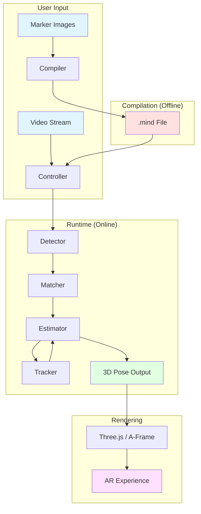

---

## 2. Compilation Flow (Offline)

```mermaid
flowchart TD
    Start([User Provides Image]) --> Canvas[Create Canvas Element]
    Canvas --> Gray[Convert to Grayscale<br/>RGB → Average]

    Gray --> Pyramid[Build Image Pyramid<br/>buildImageList]
    Pyramid --> Scales{For Each Scale}

    Scales --> Detect[Detector.detect]

    subgraph "Detector Process"
        Detect --> Gauss[Build Gaussian Pyramid<br/>5 octaves max]
        Gauss --> DoG[Compute DoG Images<br/>img2 - img1]
        DoG --> Extrema[Find Extrema<br/>Local max/min in 3x3x3]
        Extrema --> Prune[Prune to 500 Features<br/>10x10 buckets, 5 per bucket]
        Prune --> Localize[Sub-pixel Localization<br/>Quadratic fit]
        Localize --> Orient[Compute Orientations<br/>36-bin histogram]
        Orient --> Freak[Extract FREAK Descriptors<br/>37 points, 666 bits]
    end

    Freak --> Features[Feature Points Array]
    Features --> Split[Split Maxima/Minima]
    Split --> KD[Build K-D Trees<br/>hierarchicalClustering]

    KD --> NextScale{More Scales?}
    NextScale -->|Yes| Scales
    NextScale -->|No| Matching[Matching Data Complete]

    Matching --> TrackPyr[Build Tracking Pyramid<br/>2 scales: 256px, 128px]
    TrackPyr --> Worker[Spawn Worker Thread]
    Worker --> TrackExtract[Extract Tracking Features]
    TrackExtract --> Tracking[Tracking Data Complete]

    Tracking --> Combine[Combine Data]
    Combine --> Export[msgpack.encode]
    Export --> Mind[Save .mind File]
    Mind --> End([Compilation Done])

    style Start fill:#e1f5ff
    style Mind fill:#ffe1e1
    style End fill:#e1ffe1
```

---

## 3. Runtime Detection Flow (Online)

```mermaid
flowchart TD
    Start([Video Frame]) --> Input[InputLoader<br/>WebGL Grayscale]

    Input --> Crop[CropDetector<br/>Find Moving Regions]
    Crop --> Detect[Detector.detect<br/>Extract Features]

    Detect --> Worker[Send to Worker Thread]

    subgraph "Worker Thread"
        Worker --> Match[Matcher.matchDetection<br/>Try all keyframe scales]

        subgraph "For Each Keyframe"
            Match --> KDSearch[K-D Tree Search<br/>Find candidates]
            KDSearch --> Hamming[Hamming Distance<br/>Compare descriptors]
            Hamming --> Lowe[Lowe's Ratio Test<br/>Filter ambiguous]
            Lowe --> Hough[Hough Voting<br/>Geometric consistency]
            Hough --> RANSAC[RANSAC Homography<br/>Robust estimation]
            RANSAC --> Inlier[Inlier Filtering<br/>< 3px error]
            Inlier --> Pass2[Second Pass Matching<br/>Homography-guided]
        end

        Pass2 --> BestFrame[Select Best Keyframe<br/>Most matches]
        BestFrame --> Coords[Convert to 3D Coords<br/>Screen + World]

        Coords --> EstWorker[Estimator.estimate<br/>DLT Algorithm]
        EstWorker --> Pose[4x4 ModelView Matrix]
    end

    Pose --> MainThread[Return to Main Thread]
    MainThread --> Filter[One-Euro Filter<br/>Smooth pose]

    Filter --> Track{Tracking Mode?}
    Track -->|No| Output
    Track -->|Yes| Template[Template Matching<br/>Faster than detection]
    Template --> Refine[ICP Refinement<br/>Minimize error]
    Refine --> Output[3D Pose Output]

    Output --> NextFrame{Next Frame?}
    NextFrame -->|Yes| Input
    NextFrame -->|No| End([Stop])

    style Start fill:#e1f5ff
    style Output fill:#e1ffe1
    style End fill:#ffe1e1
```

---

## 4. Detector Pipeline (Feature Extraction)

```mermaid
flowchart TD
    Input([Grayscale Image Tensor]) --> Init[Initialize Detector<br/>Calculate numOctaves]

    subgraph "Step 1: Gaussian Pyramid"
        Init --> Oct0[Octave 0: Full Resolution]
        Oct0 --> Blur0[Apply Binomial Filter<br/>1,4,6,4,1 kernel]
        Blur0 --> Oct1[Octave 1: Downsample 2x]
        Oct1 --> Blur1[Apply Binomial Filter]
        Blur1 --> Oct2[Octave 2: Downsample 4x]
        Oct2 --> More[... up to 5 octaves]
    end

    More --> DoGStart[DoG Pyramid Generation]

    subgraph "Step 2: DoG Images"
        DoGStart --> Sub0[DoG0 = Blur2 - Blur1]
        Sub0 --> Sub1[DoG1 = Blur2 - Blur1]
        Sub1 --> SubN[DoG2, DoG3, ...]
    end

    SubN --> ExtremaStart[Extrema Detection]

    subgraph "Step 3: Find Extrema"
        ExtremaStart --> Compare[For each pixel in DoG1]
        Compare --> Check1{Value > 3.0?}
        Check1 -->|No| Skip1[Skip]
        Check1 -->|Yes| Check2{Local max/min<br/>vs 26 neighbors?}
        Check2 -->|No| Skip1
        Check2 -->|Yes| Check3{Edge test<br/>Hessian ratio?}
        Check3 -->|Fail| Skip1
        Check3 -->|Pass| Keep1[Keep as extrema]
    end

    Keep1 --> PruneStart[Pruning Process]

    subgraph "Step 4: Prune Extrema"
        PruneStart --> Divide[Divide into 10x10 grid<br/>100 buckets]
        Divide --> Sort[Sort by strength<br/>in each bucket]
        Sort --> Top[Keep top 5 per bucket]
        Top --> Result1[Max 500 features]
    end

    Result1 --> LocalStart[Localization]

    subgraph "Step 5: Sub-pixel Localization"
        LocalStart --> Sample[Sample 3x3 around extrema]
        Sample --> Quad[Fit quadratic surface]
        Quad --> Peak[Find peak position]
        Peak --> Adjust[Adjust x,y coordinates]
    end

    Adjust --> OrientStart[Orientation Computation]

    subgraph "Step 6: Orientation"
        OrientStart --> Region[Sample circular region]
        Region --> Grad[Compute gradients]
        Grad --> Hist[Build 36-bin histogram<br/>Weighted by magnitude]
        Hist --> Smooth[Gaussian smoothing<br/>5 iterations]
        Smooth --> PeakFind[Find peak bin]
        PeakFind --> Angle[Compute angle -π to π]
    end

    Angle --> FreakStart[FREAK Sampling]

    subgraph "Step 7: FREAK Descriptors"
        FreakStart --> Points[Sample 37 FREAK points<br/>Rotated by angle]
        Points --> Interp[Bilinear interpolation]
        Interp --> Values[37 intensity values]
        Values --> Compare2[Compare all pairs<br/>666 comparisons]
        Compare2 --> Binary[666 binary bits]
        Binary --> Pack[Pack into 167 integers]
    end

    Pack --> Output([Feature Points Array<br/>x, y, scale, angle, descriptors])

    style Input fill:#e1f5ff
    style Output fill:#e1ffe1
    style Result1 fill:#ffe1e1
```

---

## 5. Matching Pipeline

```mermaid
flowchart TD
    Start([Query Features + Keyframe]) --> Loop{For each<br/>query point}

    Loop --> Type{Maxima or<br/>Minima?}
    Type -->|Maxima| KDMax[K-D Tree: maximaCluster]
    Type -->|Minima| KDMin[K-D Tree: minimaCluster]

    subgraph "K-D Tree Search"
        KDMax --> Traverse[Traverse tree]
        KDMin --> Traverse
        Traverse --> Children[Compare to children]
        Children --> Best[Follow best path]
        Best --> Backtrack[Backtrack up to 8 nodes]
        Backtrack --> Candidates[Candidate keypoints]
    end

    Candidates --> HammLoop{For each<br/>candidate}
    HammLoop --> Hamm[Compute Hamming Distance<br/>XOR + popcount]
    Hamm --> Track[Track best & 2nd-best]
    Track --> HammNext{More<br/>candidates?}
    HammNext -->|Yes| HammLoop
    HammNext -->|No| Ratio{Best/2nd < 0.7?}

    Ratio -->|No| Reject1[Reject match]
    Ratio -->|Yes| Accept1[Accept match]

    Accept1 --> LoopNext{More<br/>queries?}
    Reject1 --> LoopNext
    LoopNext -->|Yes| Loop
    LoopNext -->|No| CheckCount{Matches >= 6?}

    CheckCount -->|No| Failed([No Match])
    CheckCount -->|Yes| Hough[Hough Voting]

    subgraph "Hough Transform"
        Hough --> Bins[Create bins:<br/>scale, rotation, position]
        Bins --> Vote[Each match votes]
        Vote --> Peak[Find peak bin]
        Peak --> HoughMatches[Filtered matches]
    end

    HoughMatches --> RANSAC[RANSAC Homography]

    subgraph "RANSAC Process"
        RANSAC --> Sample[Sample 4 random matches]
        Sample --> Compute[Compute homography H]
        Compute --> Test[Test all matches]
        Test --> Count[Count inliers < 3px]
        Count --> Iter{More<br/>iterations?}
        Iter -->|Yes| Sample
        Iter -->|No| Best2[Select best H]
    end

    Best2 --> Inliers[Filter inliers]
    Inliers --> Check2{Inliers >= 6?}
    Check2 -->|No| Failed

    Check2 -->|Yes| Pass2Start[Second Pass Matching]

    subgraph "Homography-Guided Pass"
        Pass2Start --> Invert[Invert homography H⁻¹]
        Invert --> Warp[Warp query points to keyframe space]
        Warp --> Search[Search within 10px radius]
        Search --> Hamm2[Hamming distance matching]
        Hamm2 --> Ratio2[Lowe's ratio test]
    end

    Ratio2 --> Hough2[Hough voting again]
    Hough2 --> RANSAC2[RANSAC again]
    RANSAC2 --> Final[Final inlier matches]

    Final --> Success([Homography H + Matches])

    style Start fill:#e1f5ff
    style Success fill:#e1ffe1
    style Failed fill:#ffe1e1
```

---

## 6. Pose Estimation Pipeline

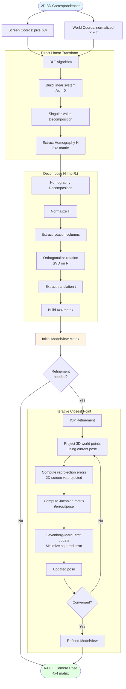

---

## 7. Controller Main Loop

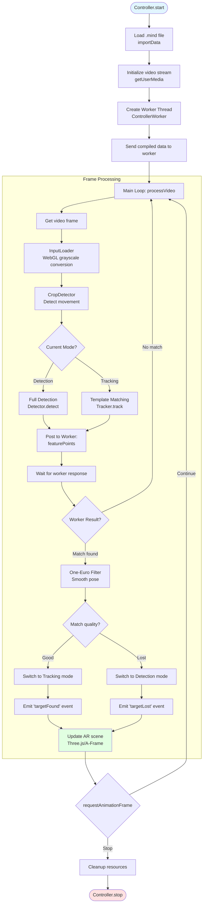

---

## 8. Worker Thread Communication

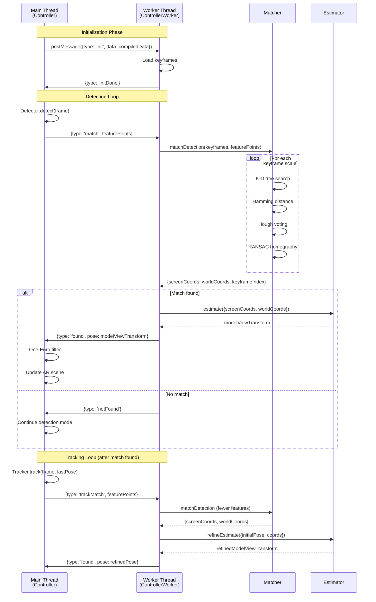

---

## 9. Data Structure Flow

```mermaid
flowchart LR
    subgraph "Input"
        A[Image File<br/>PNG/JPG]
        B[Video Frame<br/>ImageData]
    end

    subgraph "Preprocessing"
        C[Grayscale Array<br/>Uint8Array<br/>width × height]
    end

    subgraph "Image Pyramid"
        D[Scale List<br/>[1.0, 0.79, 0.63, ...]]
        E[Image List<br/>[{data, w, h, scale}, ...]]
    end

    subgraph "Detection"
        F[Pyramid Tensors<br/>[[img1, img2], ...]]
        G[DoG Tensors<br/>[diff0, diff1, ...]]
        H[Extrema Tensors<br/>[extrema0, extrema1, ...]]
    end

    subgraph "Pruning"
        I[Pruned List<br/>[[score, oct, y, x], ...]]
        J[Localized Tensor<br/>refined positions]
    end

    subgraph "Descriptors"
        K[Orientation Tensor<br/>angles -π to π]
        L[FREAK Tensor<br/>37 × features]
        M[Binary Tensor<br/>666 bits × features]
    end

    subgraph "Feature Points"
        N["Feature Array<br/>[{x, y, scale, angle,<br/>descriptors[]}, ...]"]
    end

    subgraph "Clustering"
        O[Maxima Array<br/>bright features]
        P[Minima Array<br/>dark features]
        Q[K-D Tree Maxima<br/>{rootNode, ...}]
        R[K-D Tree Minima<br/>{rootNode, ...}]
    end

    subgraph "Keyframe"
        S["Keyframe Object<br/>{maximaPoints,<br/>minimaPoints,<br/>maximaCluster,<br/>minimaCluster,<br/>width, height, scale}"]
    end

    subgraph "Compiled Output"
        T[".mind File<br/>MessagePack binary<br/>[{matchingData,<br/>trackingData}, ...]"]
    end

    subgraph "Runtime Matching"
        U[Match Array<br/>[{querypoint, keypoint}, ...]]
        V[Homography H<br/>3×3 matrix]
        W[Inlier Matches<br/>filtered < 3px]
    end

    subgraph "Pose"
        X["2D-3D Pairs<br/>{screenCoords:[{x,y}],<br/>worldCoords:[{X,Y,Z}]}"]
        Y[ModelView Matrix<br/>4×4 transform]
    end

    A --> C
    B --> C
    C --> D
    D --> E
    E --> F
    F --> G
    G --> H
    H --> I
    I --> J
    J --> K
    K --> L
    L --> M
    M --> N
    N --> O
    N --> P
    O --> Q
    P --> R
    Q --> S
    R --> S
    S --> T

    N --> U
    U --> V
    V --> W
    W --> X
    X --> Y

    style A fill:#e1f5ff
    style B fill:#e1f5ff
    style T fill:#ffe1e1
    style Y fill:#e1ffe1
```

---

## 10. Class Hierarchy

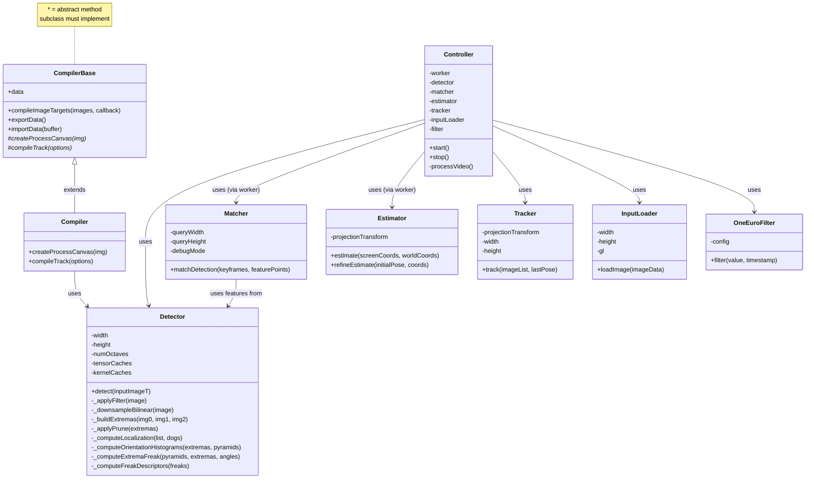

---

## 11. File Organization Flow

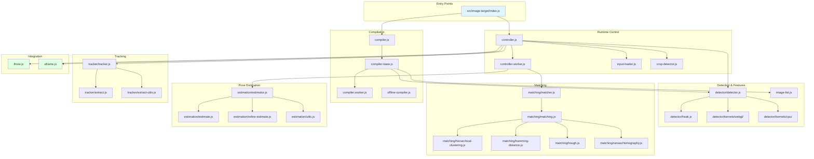

---

## 12. Algorithm Complexity Overview

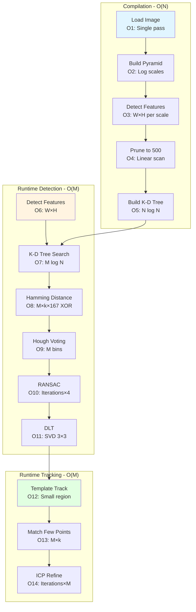

**Legend:**
- N = Number of compiled features (~500)
- M = Number of query features (~100-500)
- k = K-D tree candidates (~10-50)
- W, H = Image width, height

---

## 13. Memory Layout

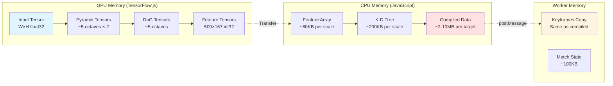

---

## 14. Threading Model

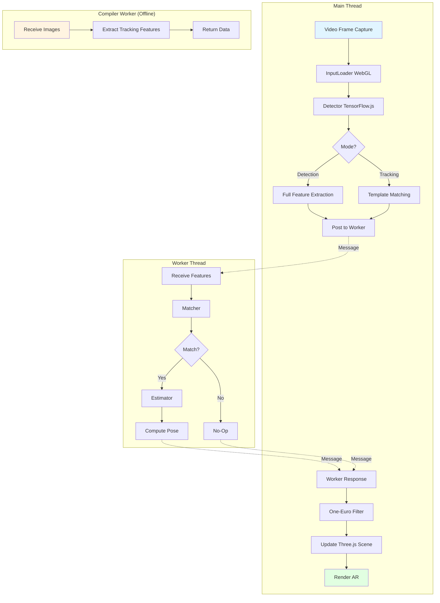

---

## 15. State Machine (Controller)

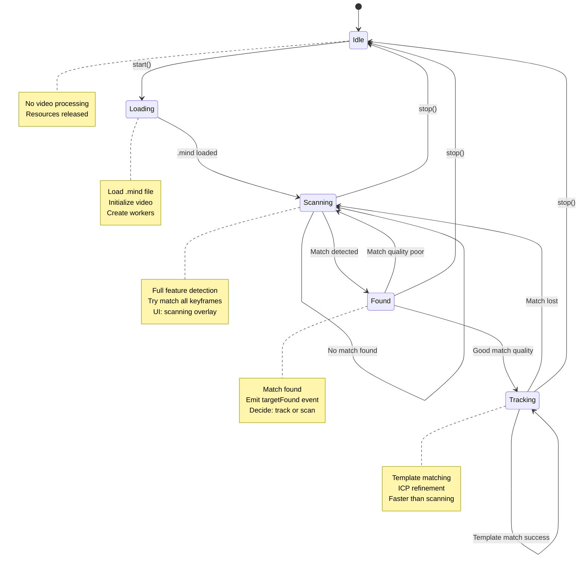

---

## 16. Coordinate System Transformations

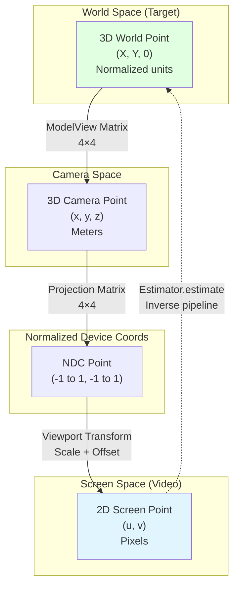

**Transformation Equations:**

```
Camera Space: [xc, yc, zc, 1]ᵀ = ModelView × [X, Y, 0, 1]ᵀ

NDC: [xn, yn, zn, w]ᵀ = Projection × [xc, yc, zc, 1]ᵀ
     (xn/w, yn/w) ∈ [-1, 1]

Screen: u = (xn/w + 1) × width/2
        v = (yn/w + 1) × height/2
```

---

## 17. Performance Optimization Strategy

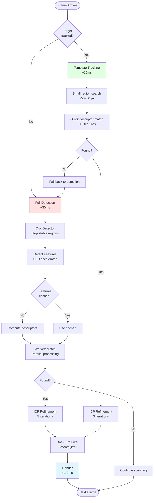

---

## Legend for All Diagrams

### Colors:
- **Light Blue** (#e1f5ff): Input/Start
- **Light Red** (#ffe1e1): Intermediate/Storage
- **Light Green** (#e1ffe1): Output/Success
- **Light Yellow** (#fff4e1): Processing/Worker

### Shapes:
- **Rectangle**: Process/Function
- **Diamond**: Decision/Branch
- **Rounded Rectangle**: Start/End
- **Parallelogram**: Input/Output
- **Cylinder**: Data Storage

---

*Flow diagrams generated for MindAR.js v1.2.5*
*Focus: Image Target Recognition System*
